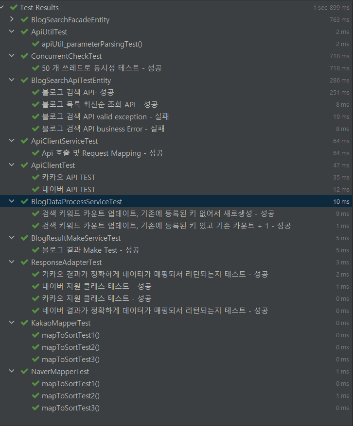
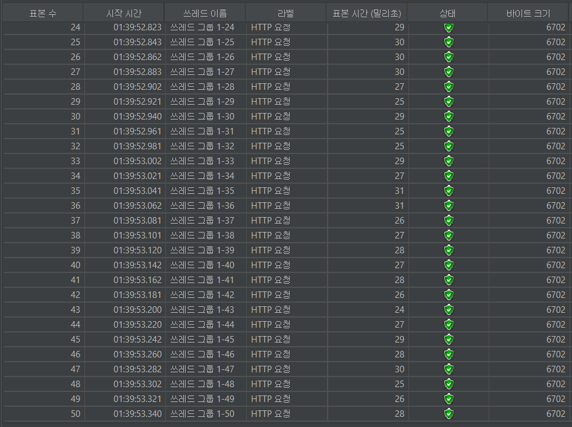

# Blog API

## 결과 JAR 파일
http://naver.me/5QG9FRK8

```
정상적인 어플리케이션 부팅을 위해 내부에 EmbededRedis를 함께 동작 시킵니다.
EmbeddedRedis 의 기본 포트는 36379 로 설정 했습니다
```

## 사용 기술
* java 11
* spring boot 2.7.9
* h2
* jpa
* redisson
* mapstruct
* embedded-redis

## API Spec

### Search blog
Spec
```
POST /search/blog
```

* Request (JsonBody)

Param명 | Param |	Type | 필수 |	Default |
---|-------|-----------|----------|------------
query |	string |	Yes |	N/A |	검색어
sort |	string |	No |	accuracy |	검색 결과 정렬 기준 (accuracy or recency)
offset	| integer |	No |	1 |	페이지 번호
limit	| integer |	No |	10 |	한 페이지에 보여질 검색 결과 수


### Get To 10 Keyword List 
Spec
```
GET /search/blog/list
```

* Request

* Response

## 테스트

### Test Code


### Jmeter 동시성


## 문제해결 전략
* 확장성
   - ErrorHandler 인터페이스를 만들고 해당 인터페이스를 구현한 클래스를 ErrorHandler List 에 의존을 주입함
   - 만약 Kakao Api 의 오류가 발생해 Exception 발생 시, 해당 ErrorHandler 가 루프를 돌며 가장 처음 주입된 ErrorHandler 를 호출
   - Kakao Api 와 Naver Api 는 같은 ApiClient 인터페이스를 구현하고 있으며 스프링이 의존관계를 주입 할 때 제네릭으로 판단하여 의존관계를 주입함
* 동시성
   - Redisson + AOP 를 사용하여 락을 걸고 동시성 문제 해결
   - AOP 를 이용해 @RedissonLock 이 걸린 Method 의 프록시 객체에 락 메소드를 감싸서 코드 의존성을 낮춤

### 대규모 트래픽에 대한 고민
