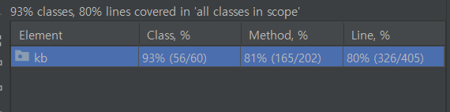

# Blog API

## 결과 JAR 파일
http://naver.me/5XDe87aF

```
정상적인 어플리케이션 부팅을 위해 내부에 EmbededRedis를 함께 동작 시킵니다.
EmbeddedRedis 의 기본 포트는 36379 로 설정 했습니다
```

## 사용 기술
* java 11
* spring boot 2.7.9
* h2
* jpa
* redisson
* mapstruct
  * Request, Response, Entity 파싱
* embedded-redis
  * 서비스 부팅, 레디션 락 테스트 

## API Spec

### Search blog
Spec
```
POST /search/blog
Content-Type application/json
```

* Request 

Param명 | 	Type | 필수 |	Default | 설명 |
------|----------|----------|------------ | -----|
keyword |	string    |	 O|	N/A  | 검색어
sort  |	string    |	 X | accuracy	| 검색 결과 정렬 기준 (accuracy or recency)
offset	| integer |	 X |	1 | 페이지 번호
limit	| integer |	 X | 10	| 한 페이지에 보여질 검색 결과 수

* Response

Param명 | 	Type |  설명 |
------|----------|--------- |
result |string    | 결과 SUCCESS/FAIL
**data**  |	object    | Data
 -- totalCount 	| integer | 총건수
 -- isEnd	| integer | 끝인지
 -- items	| record | 조회 목록
---- title	| string | 타이틀
---- blogLink	| string | 블로그 링크
---- bloggerName	| string | 블로거명
---- contents	| string | 컨텐츠
---- createAt	| string | 생성일자

* Example

```json
{
  "result": "SUCCESS",
    "data": {
        "totalCount": 225,
        "isEnd": false,
        "items": [
            {
                "title": "아이랑 대만여행, 양명산 벚꽃축제 GO! 버스타고 봄 바람난 양명산 꽃시계 보러 가볼까 陽明花季",
                "blogLink": "https://blog.naver.com/becky_unme/223021233908",
                "bloggerName": "대만생활백서",
                "contents": "학교<b>TES</b> 와 같은 국제학교들이 있는 지역이라, 할로윈 축제할 적에는 아이들이 코스튬 입고 가게가게마다 사탕얻으러 다닌다고 바쁘다. ​ ​ 사진만 보면 순박한 시골풍경같은 이 길은 타이베이 대표산인 양명산陽明山으로 가는 길목 ​ ​ 도시 가까이에 있는 산이라 도로가 참 잘 닦여있다. ​ 양명산의 곳곳에는 숨겨진 보석...",
                "createAt": "2023-02-20T01:22:00.000+09:00"
            },
        ...
    }
}
```


### Get To 10 Keyword List 
Spec
```
GET /search/blog/keyword/list
```

* Request

* Response

Param명 | 	Type |  설명 |
------|----------|--------- |
result |string    | 결과 SUCCESS/FAIL
**data**  |	record    | Data
---- keyword	| string | 키워드
---- count	| string | 조회 건수
---- createAt	| string | 최초생성일자


* Example

```json
{
    "result": "SUCCESS",
    "data": [
        {
            "keyword": "tes111",
            "count": 1,
            "createAt": "2023-03-22T20:08:30.260139"
        }
    ]
}
```


## 테스트

### Test Code


### Jmeter 동시성


### coverage


## 문제해결 전략
* 확장성
   - ErrorHandler 인터페이스를 만들고 해당 인터페이스를 구현한 클래스를 ErrorHandler List 에 의존을 주입함
   - 만약 Kakao Api 의 오류가 발생해 Exception 발생 시, 해당 ErrorHandler 가 루프를 돌며 가장 처음 주입된 ErrorHandler 를 호출
   - Kakao Api 와 Naver Api 는 같은 ApiClient 인터페이스를 구현하고 있으며 스프링이 의존관계를 주입 할 때 제네릭으로 판단하여 의존관계를 주입함 (제네릭만 바꾸면 Main api를 naver로 변경 가능)
* 동시성
   - Redisson + AOP 를 사용하여 락을 걸고 동시성 문제 해결
   - AOP 를 이용해 @RedissonLock 이 걸린 Method 의 프록시 객체에 락 메소드를 감싸서 코드 의존성을 낮춤


### 대규모 트래픽에 대한 고민
* Redis 를 사용
  * 키워드를 저장할 때, DB 에 저장, 읽을 때 캐시에서 읽고, 캐시에 없으면 DB 조회후 캐시 저장 
  * 일정 시간마다 DB 데이터를 캐시에 동기화 시켜주는 작업 필요 
  * 읽을 때 메모리에서 읽어오므로 조회 시 빠른 속도가 나올 것으로 기대됨
